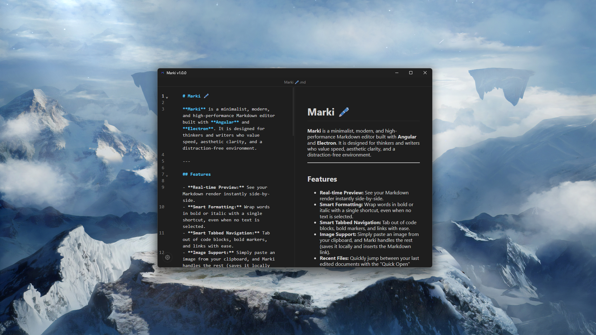

# Marki 🖋️

**Marki** is a minimalist, modern, and high-performance Markdown editor built with **Angular** and **Electron**. It is designed for thinkers and writers who value speed, aesthetic clarity, and a distraction-free environment.



---

## Features

- **Real-time Preview:** See your Markdown render instantly side-by-side.
- **Smart Formatting:** Wrap words in bold or italic with a single shortcut, even when no text is selected.
- **Smart Tabbed Navigation:** Tab out of code blocks, bold markers, and links with ease.
- **Image Support:** Simply paste an image from your clipboard, and Marki handles the rest (saves it locally and inserts the Markdown link).
- **Recent Files:** Quickly jump between your last edited documents with the "Quick Open" overlay.
- **Auto-Save:** Your work is protected with debounced auto-save and an unsaved changes guard.


- **PDF Export:** Turn your notes into clean, professional PDF documents.
- **Customizable UI:** Support for Dark/Light mode and different layout presets (Split view, Editor-only, Preview-only).


---

## Shortcuts

Efficiency is at the core of Marki. Use these shortcuts to stay in the flow:

### File Management
| Shortcut | Action |
|----------|--------|
| **Ctrl + N** | New Document |
| **Ctrl + O** | Open File |
| **Ctrl + Alt + O** | Quick Open (Recent Files) |
| **Ctrl + S** | Save Document |
| **Ctrl + Shift + S** | Export as PDF |
| **Ctrl + P** | Set Default Working Directory |
| **Ctrl + ,** | Open Settings |

### Editing & Formatting
| Shortcut | Action |
|----------|--------|
| **Ctrl + B** | Bold / Toggle Bold |
| **Ctrl + I** | Italic / Toggle Italic |
| **Ctrl + H** | Cycle Header Level (#, ##, ###) |
| **Ctrl + K** | Insert Hyperlink |
| **Ctrl + Shift + C** | Insert Code Block / Wrap in Code |
| **Ctrl + Z** | Undo |
| **Ctrl + Y** | Redo |
| **Alt + ↑ / ↓** | Move Current Line Up / Down |
| **Tab** | Smart-jump out of markers (`, **, ], ) |

---

## Setup & Installation

### 1. Prerequisites
Ensure you have **Node.js** (LTS version) installed.

### 2. Installation
```bash
npm install
```

### 3. Development
```bash
npm start
```

### 4. Build Installers
To generate a production-ready installer for your system:

#### Windows
```bash
npm run make-installer
```

#### Linux
```bash
npm run make-linux
```

---

*Made with ❤️ by [Tobias](https://github.com/Toobiass)*